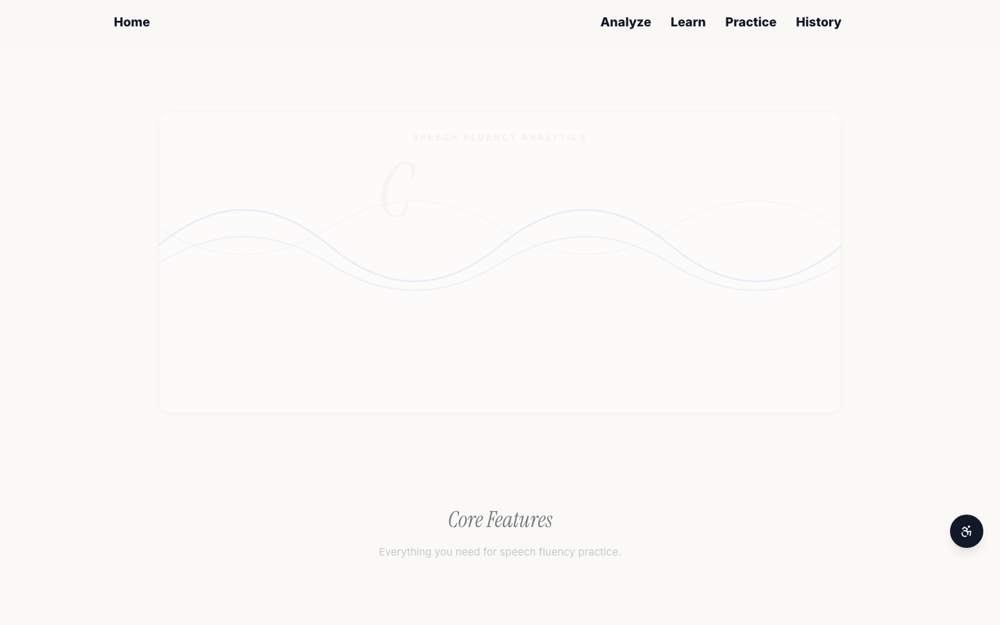
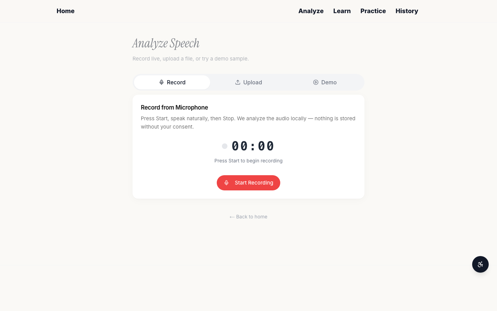
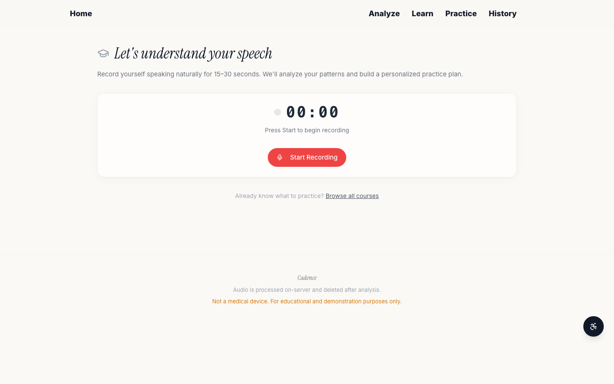
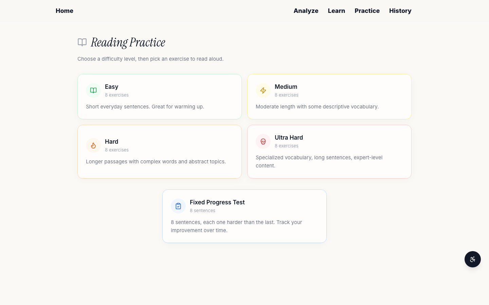
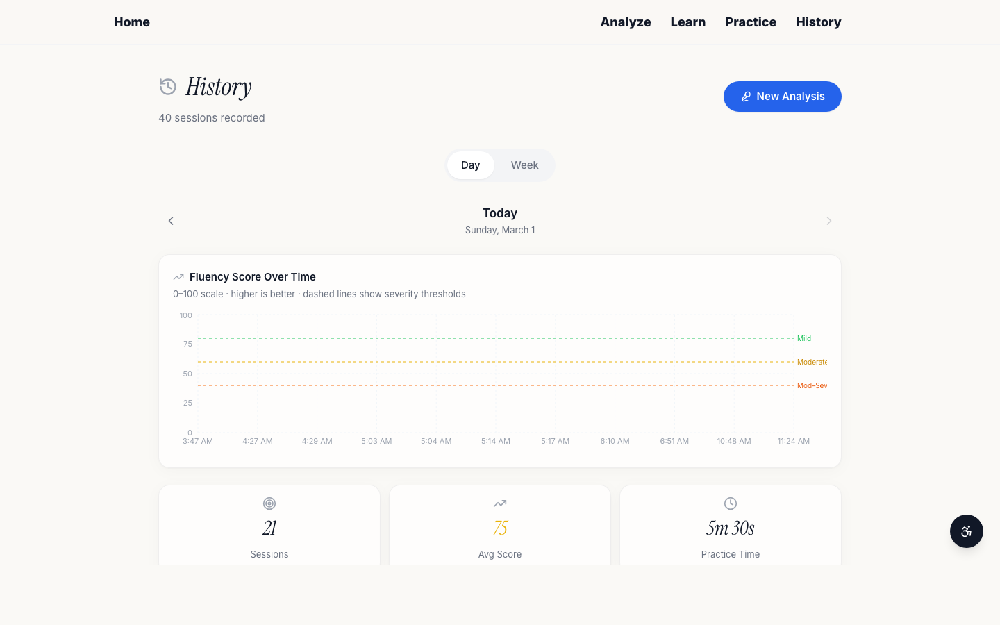
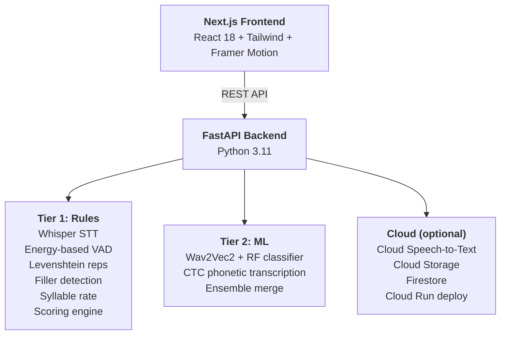

<div align="center">

<p align="center">
  
</p>
<p align="center">
  
</p>


<br/><br/>

[](https://frontend-three-rho-71.vercel.app)
&nbsp;
[](https://cadence-api-qrotwdz63a-uc.a.run.app/health)
&nbsp;
[](https://cheesehacks.com)

<br/>

> **`Record or upload speech → Instant disfluency detection → Fluency scoring → Personalized practice plans`**

<br/>


<br/><br/>

<table>
<tr>
<td align="center"><b>Siddhant Choudhary</b><br/><sub>Full-Stack + ML + Cloud</sub></td>
<td align="center"><b>Christian Cortez</b><br/><sub>Backend + Signal Processing</sub></td>
<td align="center"><b>Anish Mantri</b><br/><sub>Frontend + UI/UX</sub></td>
<td align="center"><b>Benjamin Lelivelt</b><br/><sub>Frontend + Accessibility</sub></td>
</tr>
</table>

<br/>


</div>

---

## The Problem

Over 80 million people worldwide stutter. Speech therapy is expensive, waitlists are long, and there are almost no tools for self-directed practice between sessions. People who stutter have no objective way to track their fluency over time or identify which specific patterns they struggle with most.

## Our Solution

Cadence is a browser-based platform that analyzes speech disfluencies using a custom two-tier signal processing + ML pipeline. It detects **blocks**, **repetitions**, **prolongations**, and **filler words**, then provides a fluency score, visual timeline, and adaptive practice courses — all without requiring a clinician in the loop.

---

## Screenshots of UI

| Home | Analyze |
|:----:|:-------:|
|  |  |

| Learn | Practice | History |
|:-----:|:--------:|:-------:|
|  |  |  |

---

## Key Features

**Analysis** — Upload audio or record in-browser. The pipeline runs Whisper transcription, energy-based VAD, Levenshtein repetition matching, filler detection, CMUDict syllable-rate analysis, and (in Tier 2) a Wav2Vec2 neural classifier with CTC phonetic transcription. Results include a 0-100 fluency score, severity classification, disfluency event timeline overlaid on the waveform, word-level transcript highlighting, and speaking rate metrics.

**Practice** — 32 reading exercises across 4 difficulty tiers (Easy through Ultra Hard) plus a Fixed Progress Test with 8 progressively harder sentences. Word-by-word color-coded feedback shows what was matched, missed, or flagged as a disfluency. Scores are tracked per exercise with previous attempt and all-time best.

**Learn** — A diagnostic test identifies the user's primary disfluency type, then recommends from 4 adaptive courses (Blocks, Repetitions, Prolongations, Fillers). Each course has 5 levels. Score 80+ to pass; 3 consecutive passes to advance.

**History** — Apple Screen Time-inspired session history with day/week toggle, severity-colored bar charts, date navigation, and aggregate statistics.

**Google Cloud Integration** — Optional cloud layer that enhances every part of the platform. Cloud Speech-to-Text runs dual transcription alongside Whisper to catch words that local models normalize away (e.g., stuttered fragments). Cloud Storage provides durable audio persistence so recordings survive server restarts. Firestore replaces SQLite in production for cloud-native session and progress storage. All deployed on Cloud Run with a Docker container that pre-downloads ML models at build time for zero cold-start latency. Every GCP feature degrades gracefully — the app works fully offline without credentials.

**Accessibility** — High contrast mode, large text, reduced motion, adjustable text spacing, full keyboard navigation, ARIA labels on all interactive elements.

---

## Architecture



| Layer | Technology |
|:------|:-----------|
| **Backend** | Python 3.11, FastAPI, SQLAlchemy + SQLite |
| **Frontend** | Next.js 14 (App Router), React 18, TypeScript, Tailwind CSS |
| **ML / DSP** | PyTorch, Wav2Vec2, faster-whisper, librosa, scikit-learn |
| **Cloud** | Google Cloud Speech-to-Text, Cloud Storage, Firestore, Cloud Run |
| **UI** | Framer Motion, Recharts, WaveSurfer.js, Radix UI |

---

## Quick Start

### Prerequisites

Install these **before** cloning:

| Dependency | Install | Verify |
|:-----------|:--------|:-------|
| **Python 3.9+** | [python.org](https://python.org) | `python3 --version` |
| **Node.js 18+** | [nodejs.org](https://nodejs.org) | `node --version` |
| **ffmpeg** | `brew install ffmpeg` (macOS) / `sudo apt install ffmpeg` (Linux) | `ffmpeg -version` |

> ffmpeg is **required** — audio analysis will fail without it.

### 1. Clone

```bash
git clone https://github.com/schoudhary90210/Cadence.git
cd Cadence
```

### 2. Backend

```bash
cd backend
python3 -m venv venv
source venv/bin/activate
pip install --upgrade pip
pip install -r requirements.txt
uvicorn main:app --host 0.0.0.0 --port 8000
```

> First startup downloads ML models (~500 MB) and NLTK data. This takes 1-2 minutes — subsequent runs are instant.

**Verify:** Open `http://localhost:8000/health` — should return `{"status": "ok", "mode": "HYBRID_ML"}`

### 3. Frontend

Open a **second terminal**:

```bash
cd Cadence/frontend
npm install
npx next build
npx next start -p 3000
```

**Verify:** Open `http://localhost:3000` — you should see the Cadence home page.

> Both terminals must stay open. Backend on port 8000, frontend on port 3000.

---

## Scoring

| Disfluency Type | Penalty per Event |
|:----------------|:-----------------:|
| Block (silence > 600ms mid-utterance) | 15 pts |
| Prolongation (stretched sounds) | 12 pts |
| Sound Repetition (s-s-so) | 10 pts |
| Word Repetition (I I I want) | 8 pts |
| Filler (um, uh, like) | 5 pts |

**Score = 100 - total penalties** (clamped 0-100). Severity bands: Mild (80-100), Moderate (60-79), Moderate-Severe (40-59), Severe (0-39).

---

## Demo Samples

Three pre-cached samples return results instantly for live demos:

| Sample | Score | Severity | Events |
|:-------|:-----:|:--------:|:------:|
| `fluent_sample.m4a` | ~97 | Mild | 0 |
| `stuttered_sample.m4a` | ~59 | Moderate-Severe | 5 |
| `mixed_sample.m4a` | ~80 | Moderate | 1 |

---

## Project Structure

```
Cadence/
├── backend/
│   ├── main.py                     # FastAPI app + all routes
│   ├── config.py                   # Tunable thresholds
│   ├── pipeline/                   # Analysis pipeline
│   │   ├── orchestrator.py         # Pipeline coordinator
│   │   ├── audio_preprocessing.py  # Format conversion (16kHz mono WAV)
│   │   ├── transcription.py        # faster-whisper word-level STT
│   │   ├── vad.py                  # Voice Activity Detection
│   │   ├── repetition.py           # Levenshtein repetition detection
│   │   ├── filler.py               # Filler word detection
│   │   ├── prolongation.py         # Autocorrelation + spectral flatness
│   │   ├── speaking_rate.py        # CMUDict syllable counting
│   │   ├── scoring.py              # Composite fluency scoring
│   │   ├── wav2vec_classifier.py   # Wav2Vec2 + RandomForest (Tier 2)
│   │   ├── wav2vec_phonetic.py     # CTC phonetic transcription (Tier 2)
│   │   └── cloud_stt.py            # Google Cloud STT integration
│   ├── models/schemas.py           # Pydantic data models
│   ├── db/                         # SQLAlchemy + SQLite
│   ├── learn/                      # Adaptive course system
│   └── demo_samples/               # Pre-cached demo audio + results
├── frontend/
│   ├── app/                        # Next.js App Router pages
│   ├── components/                 # React components
│   └── lib/                        # Typed API client + types
├── scripts/                        # GCP deploy scripts
└── CREDITS.md                      # Full dependency attribution
```

---

## API

| Method | Endpoint | Description |
|:------:|:---------|:------------|
| `GET` | `/health` | Server status and analysis mode |
| `POST` | `/analyze` | Upload audio for full pipeline analysis |
| `GET` | `/sessions` | List past sessions |
| `GET` | `/sessions/{id}` | Full result for a session |
| `GET` | `/sessions/stats` | Aggregate statistics |
| `GET` | `/demo-samples` | List demo audio files |
| `POST` | `/demo-samples/{filename}/analyze` | Analyze a demo sample |
| `GET` | `/practice/passages` | Reading practice passages |
| `GET` | `/practice/prompts` | Conversation prompts |
| `GET` | `/learn/courses` | Available courses |
| `GET` | `/learn/courses/{type}/exercise` | Get exercise for a course level |
| `POST` | `/learn/courses/{type}/sessions` | Submit a learn session |
| `POST` | `/learn/diagnostic` | Run diagnostic test |
| `GET` | `/learn/progress/{user_id}` | User progress |

---

## Troubleshooting

| Issue | Fix |
|:------|:----|
| `ModuleNotFoundError` | Activate the venv: `source venv/bin/activate` |
| "Analysis failed" on record/upload | Install ffmpeg: `brew install ffmpeg` (macOS) or `sudo apt install ffmpeg` (Linux) |
| Models downloading slowly | First run downloads ~500 MB. Subsequent runs are instant. |
| Port already in use | `lsof -ti:8000 \| xargs kill -9` then restart backend |
| Frontend can't reach backend | Make sure backend is running on port 8000 in a separate terminal |
| Frontend build fails | `rm -rf .next node_modules && npm install && npx next build` |
| CORS errors | Backend must be on port 8000, frontend on 3000 |
| Google Cloud errors | Optional — app works fully without GCP credentials |

---

<div align="center">

*Cadence is a prototype fluency analytics tool for educational purposes — not a medical diagnostic device.*

**CheeseHacks 2026 — Health & Lifestyle**

**Siddhant Choudhary** | **Christian Cortez** | **Anish Mantri** | **Benjamin Lelivelt**

</div>
